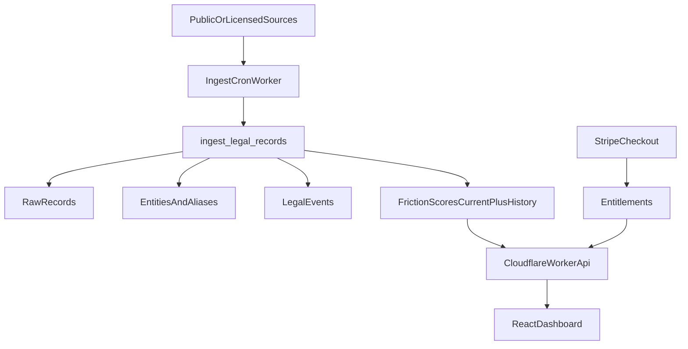

# Vortx Stack

Vortx is built as a Cloudflare + Supabase B2B data product.

## Runtime

- **Frontend:** React, Vite, Tailwind.
- **Edge/API:** Cloudflare Worker with static assets and JSON APIs.
- **Database:** Supabase Postgres with RLS, service-role writes from Worker/jobs, and no public access to raw records.
- **Ingestion:** Cloudflare Worker `vortx-ingest-cron` → Supabase RPC `ingest_legal_records` (Python `services/litigation-ingest/` is scaffold only).
- **Payments:** Stripe Checkout through the preserved Worker endpoint.

## Data Flow

## Worker Routes

- `GET /api/health`
- `POST /api/stripe-checkout`
- `GET /api/friction-feed`
- `GET /api/entities/:id`
- `GET /api/source-transparency`
- `GET /api/watchlists`
- `POST /api/watchlists`
- `POST /api/alerts/test`

## Security Defaults

- Raw records and customer watchlists are not publicly readable.
- Service role keys stay server-side only.
- Source records must retain evidence URLs and retrieval metadata.
- Legal surfaces must avoid implying guilt, liability, or financial advice.

## Deploy

`wrangler.jsonc` builds `frontend/` and deploys `frontend/dist` through the Worker assets binding.

Required secrets and environment variables should be set in Cloudflare or local `.dev.vars`. Do not commit real values.
