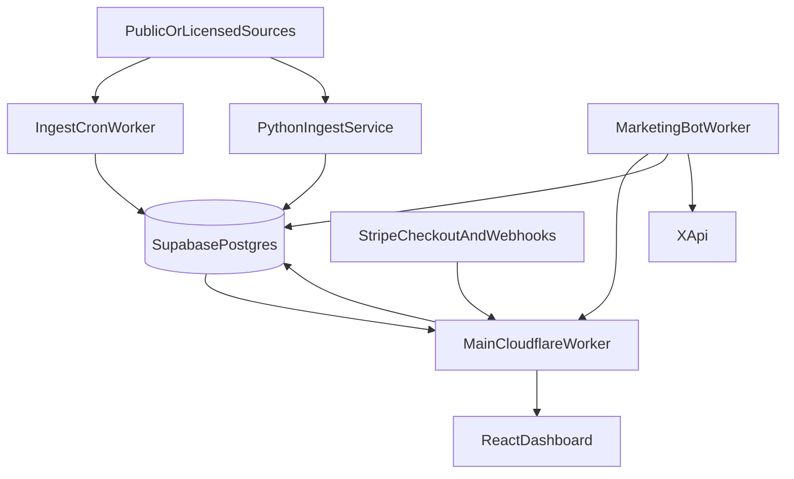

# Vortx Operations Runbook

This runbook is the consolidated operating guide for the Vortx public-record legal intelligence project. It merges the project README, stack notes, growth notes, ingestion notes, Supabase notes, and marketing bot notes into one file.

Vortx is a B2B public-record legal intelligence platform. It aggregates public or licensed records, normalizes them into entity timelines, computes transparent friction scores, and sells source-linked discovery workflows to professional subscribers.

Vortx is not a consumer speculation product, legal advice product, credit decisioning product, debt collection product, trading product, or investment advice product.

## Audience and go-to-market

Vortx sells to **all** market segments;not only credit or litigation buyers. Full hooks, channels, tier bias, and copy rules: **`docs/AUDIENCE.md`**. Cursor agents must follow **`.cursor/rules/Vortx-Audience.mdc`**.

| Segment | Hook (lead angle) | Primary reach |
| --- | --- | --- |
| Retail investors & day traders | Before you hold a position, here's what the public record shows… | X, Reddit, StockTwits |
| Small business owners | Before you sign a 6-figure contract, run these 3 public record checks. | LinkedIn, local biz groups |
| Journalists & researchers | The story ran later. The WARN notice was already public. | Journalism X, Press Gazette |
| Real estate pros | Lien clusters show up before the default story. | BiggerPockets, RE LinkedIn |
| Paralegals & legal ops | Adversary proceedings start later; the public record is earlier. | CLOC, ACC ; **Pro conversion** |
| HR & workforce | Your competitor filed a WARN. The public knew first. | SHRM, HR LinkedIn |
| Curious general public | Public, updated daily;most people don't know. | X, Reddit, TikTok (virality) |
| Credit & vendor risk | Receipts before the quarterly review. | Enterprise email |

Website lead form `use_case` values align with these segments (`investors`, `smb`, `journalism`, etc.). X bot templates `template-2`–`template-17` in `worker/x-marketing-cron.js` map to segment hooks.

## Quick Commands

Run these from the project root unless noted:

```bash
cd /home/dbz/vibe-seo/vortx
npm install
npm run ops:check
npm run deploy
npm run ingest:run
npm run marketing:preview
npm run marketing:post
npm run marketing:deploy
node scripts/sync-approved-bundle.mjs
```

Frontend commands:

```bash
cd /home/dbz/vibe-seo/vortx/frontend
npm install
npm run dev
npm run typecheck
npm run build
npm run verify
```

## Project Layout

| Path | Purpose |
| --- | --- |
| `docs/AUDIENCE.md` | Full-market segments, hooks, channels, and messaging matrix. |
| `README.md` | Original high-level product and repo map. Superseded for ops by this runbook. |
| `STACK.md` | Original architecture and data-flow summary. Merged here. |
| `GROWTH.md` | Original buyer/revenue/launch notes. Merged here. |
| `MARKETING_BOT.md` | Original X marketing bot guide. Merged here. |
| `worker/index.js` | Main Cloudflare Worker for website assets and APIs. |
| `worker/ingest-cron.js` | Scheduled data ingestion Worker. |
| `worker/x-marketing-cron.js` | Scheduled X marketing bot Worker. |
| `frontend/` | React, Vite, Tailwind dashboard. |
| `frontend/functions/api/` | Worker-compatible API handlers for auth, Stripe, leads, dashboards. |
| `frontend/functions/lib/` | Shared Worker env and Supabase REST helpers. |
| `services/litigation-ingest/` | Python adapter-based ingestion framework and tests. |
| `supabase/ingest_rpc.sql` | Bulk ingestion RPC for source, raw record, event, evidence, score writes. |
| `.dev.vars.example` | Local environment template. Never commit real `.dev.vars`. |
| `wrangler.jsonc` | Main website/API Worker deployment config. |
| `wrangler.ingest.jsonc` | Data ingestion cron Worker config. |
| `wrangler.marketing.jsonc` | Scheduled marketing bot Worker config. |

## Architecture



## Product Surfaces

| Surface | Purpose |
| --- | --- |
| Public marketing site | Explains the product and routes users to pricing/request access. |
| Friction feed | Entity-linked public-record queue with redaction for public users. |
| Entity timeline | Subscriber/admin view of records, source links, dates, and context. |
| Watchlists and alerts | Subscriber workflows for monitoring companies, vendors, debtors, accounts, or competitors. |
| Source transparency | Public/source registry showing source status, access method, record type, and cadence. |
| Stripe checkout | Converts users into paid tiers and preserves acceptable-use acknowledgement. |
| Customer dashboard | Subscriber portal for watchlists, alerts, exports, and entitlement-delimited data. |
| Admin dashboard | Operator portal for customer entitlements, service requests, source status, data counts, and ingestion oversight. |
| X marketing bot | Daily company spotlight post with one free signal and paid CTA. |

## Legal And Compliance Posture

Use this framing everywhere:

- Vortx aggregates public or licensed records for research and business intelligence.
- Records can be filings, notices, dockets, liens, or administrative artifacts.
- A record does not prove wrongdoing, liability, credit risk, investment merit, or future legal outcome.
- Scores reflect record recency, severity, and source confidence.
- Higher scores indicate records that warrant earlier review.
- Vortx does not provide legal, financial, credit, debt collection, trading, or investment advice.
- Avoid consumer profiling. Keep bankruptcy and financial-distress use business/entity-focused.

Do not use these claims in UI, posts, docs, or sales copy:

- "guilty", "fraud", "scam", "exposed", "secret", "hiding", "in trouble"
- "buy", "sell", "short", "trade", "profit", "guaranteed"
- "risk-free", "free trial" unless a real approved offer exists
- Any statement that a company filed for bankruptcy unless the exact source record supports that exact claim

## Environment And Secrets

Real env files are local sensitive state. Never commit:

- `.env`
- `.env.*`
- `.env.local`
- `.dev.vars`
- Any file containing service role keys, Stripe secrets, X tokens, Cloudflare tokens, tunnel tokens, or API keys

Use `.dev.vars.example` as the template.

Core env names:

```env
PUBLIC_SITE_URL=
VITE_SUPABASE_URL=
VITE_SUPABASE_PUBLISHABLE_KEY=
SUPABASE_SERVICE_ROLE_KEY=
VORTX_ADMIN_EMAILS=
VORTX_ADMIN_BOOTSTRAP_EMAIL=
VORTX_ADMIN_BOOTSTRAP_PASSWORD=
STRIPE_PRODUCT_ID=
STRIPE_NEBULA_PRICE_ID=
STRIPE_PULSAR_PRICE_ID=
STRIPE_SUPERNOVA_PRICE_ID=
STRIPE_GALACTIC_PRICE_ID=
STRIPE_CUSTOM_PRICE_ID=
STRIPE_CUSTOM_MODE=
STRIPE_SECRET_KEY=
STRIPE_WEBHOOK_SECRET=
COURTLISTENER_API_TOKEN=
PACER_USERNAME=
PACER_PASSWORD=
```

Marketing bot env names:

```env
X_API_KEY=
X_API_SECRET=
X_BEARER_TOKEN=
X_ACCESS_TOKEN=
X_ACCESS_TOKEN_SECRET=
X_OAUTH2_USER_TOKEN=
MARKETING_BOT_ENABLED=
MARKETING_BOT_DRY_RUN=
MARKETING_BOT_RUN_TOKEN=
MARKETING_CTA_URL=
MARKETING_IMAGE_MODE=
MARKETING_IMAGE_REQUIRED=
MARKETING_BOT_ROTATION_OFFSET=
MARKETING_CREATIVE_MODE=
OLLAMA_BASE_URL=
OLLAMA_MODEL=
OLLAMA_REQUIRED=
```

Cloudflare env names:

```env
CLOUDFLARE_API_TOKEN=
CLOUDFLARE_ACCOUNT_ID=
CLOUDFLARE_ZONE_ID=
CLOUDFLARED_TUNNEL_TOKEN=
```

## Install And Local Setup

Root project:

```bash
cd /home/dbz/vibe-seo/vortx
npm install
cp .dev.vars.example .dev.vars
```

Frontend:

```bash
cd /home/dbz/vibe-seo/vortx/frontend
npm install
npm run dev
```

The main Worker serves built frontend assets from `frontend/dist` through the assets binding in `wrangler.jsonc`.

Build frontend:

```bash
cd /home/dbz/vibe-seo/vortx/frontend
npm run verify
```

Run Worker locally:

```bash
cd /home/dbz/vibe-seo/vortx
npm run worker:dev
```

## Main Website And API Worker

Config:

- Worker name: `vortx`
- Config file: `wrangler.jsonc`
- Entry point: `worker/index.js`
- Assets: `frontend/dist`
- Domains: `vortxmkt.com`, `www.vortxmkt.com`
- Build command: `node scripts/ensure-patched-dist.mjs`

Deploy:

```bash
cd /home/dbz/vibe-seo/vortx
set -a && . ./.dev.vars && set +a
npm run deploy
```

Useful public/API routes:

| Route | Purpose |
| --- | --- |
| `GET /api/health` | Basic API health. |
| `GET /api/friction-feed` | Public or authed entity/event feed. Public response redacts entity names and source URLs. |
| `GET /api/source-transparency` | Source registry and source status. |
| `GET /api/entitlements` | Plan/entitlement metadata. |
| `GET /api/me` | Current authenticated profile. |
| `POST /api/stripe-checkout` | Stripe Checkout session creation. Requires acceptable-use acknowledgement. |
| `POST /api/stripe-webhook` | Stripe webhook processing. |
| `POST /api/request-access` | Lead capture. |
| `GET /api/customer/dashboard` | Authenticated customer dashboard. |
| `POST /api/customer/service-requests` | Customer request creation. |
| `GET /api/customer/export` | Customer export. |
| `GET /api/map/signals` | Public, redacted, viewport-bounded map GeoJSON. Requires `bounds`. |
| `GET /api/enterprise/map/signals` | Enterprise-key viewport API with full map fields and filters. |
| `GET /api/admin/dashboard` | Admin operating dashboard (profiles, leads, checkouts, audits). |
| `PATCH /api/admin/users` | Admin upgrade: `{ user_id?, email?, plan?, subscription_status?, role? }`. |
| `PATCH /api/admin/sources` | Admin source management. |
| `PATCH /api/admin/service-requests` | Admin service request management. |

Enterprise Map API documentation:

- Public docs: `https://vortxmkt.com/docs/map-api.html`
- Repository docs: `docs/MAP-API.md`
- Create/rotate a key: `npm run map:api-key -- --email=owner@example.com`
- Revoke a key: `npm run map:api-key -- --email=owner@example.com --revoke`
- Raw API keys are shown once; only SHA-256 hashes are stored in `api_subscribers`.

## Admin Setup And Access

Admin bootstrap requires these local `.dev.vars` keys:

```env
VITE_SUPABASE_URL=
SUPABASE_SERVICE_ROLE_KEY=
VORTX_ADMIN_EMAILS=admin@example.com
VORTX_ADMIN_BOOTSTRAP_EMAIL=admin@example.com
VORTX_ADMIN_BOOTSTRAP_PASSWORD=
```

The bootstrap email must also appear in `VORTX_ADMIN_EMAILS`.

Create or update the admin:

```bash
cd /home/dbz/vibe-seo/vortx
npm run admin:bootstrap
```

What the bootstrap does:

- Creates or updates the Supabase Auth user.
- Confirms the email.
- Sets `user_metadata.role=admin`.
- Sets `app_metadata.role=admin`.
- Upserts `app_profiles` with `role=admin`, `plan=custom`, `subscription_status=active`.

Login:

```text
https://vortxmkt.com/?view=customer
https://vortxmkt.com/?view=admin
```

Admin status is enforced by:

- Supabase Auth bearer token
- `app_profiles.role = admin`
- Active subscription status
- `VORTX_ADMIN_EMAILS`

## Customer Entitlements And Oversight

Customer access is driven by `app_profiles` and entitlement tables.

Important tables to watch:

| Table | Purpose |
| --- | --- |
| `app_profiles` | User profile, role, plan, subscription status. |
| `entitlements` | Plan limits and tier labels. |
| `checkout_sessions` | Stripe Checkout attempts and metadata. |
| `sales_leads` | Request-access form submissions. |
| `service_requests` | Customer/admin service workflow. |
| `query_audit_events` | Audit trail for subscriber/admin queries. |

Operational checks:

```bash
cd /home/dbz/vibe-seo/vortx
npm run ops:check
```

`ops:check` checks:

- API route status
- Auth gates on customer/admin dashboards
- Supabase row counts
- Friction feed entity/event counts
- Enabled source counts

## Data Model And Storage

The active ingestion/storage model uses these logical tables:

| Table | Purpose |
| --- | --- |
| `source_catalog` | Source registry, access method, record type, enabled status, cadence, auth requirements. |
| `raw_records` | Retrieved source payloads; unique on `(source_id, source_record_id)` plus `payload_hash`. |
| `entities` | Normalized business/entity records (`canonical_name`, `normalized_name`). |
| `entity_aliases` | Alternate names → entity (unique `normalized_alias`). |
| `legal_events` | Entity-linked filings, notices, dockets, and legal/administrative events. |
| `event_evidence` | Source evidence and URLs for events. |
| `friction_scores` | Current score per entity (`UNIQUE(entity_id)`). |
| `friction_score_history` | Append-only score history; pruned by retention. |
| `entity_watchlists` | Subscriber watchlists (`entity_ids[]` denormalized cache). |
| `entity_watchlist_members` | Watchlist ↔ entity junction (preferred membership source). |

Security posture (migration `20260703190000_security_advisor_fixes.sql`):

- `entity_watchlists` has RLS enabled with owner-only (`auth.uid()`) select/insert/update/delete policies.
- Views `public.companies` and `public.signals` run as `security_invoker = true`, so anon/authenticated reads go through the ticker-only RLS policies on `entities`/`legal_events`.
- Leaked-password protection is a dashboard setting: Supabase → Authentication → Settings → enable password strength/leaked-password checks (HaveIBeenPwned). It cannot be set from SQL migrations.

`supabase/ingest_rpc.sql` defines `public.ingest_legal_records(source jsonb, records jsonb)` for bulk ingest. Access is revoked from `public`, `anon`, and `authenticated`; only trusted server/service role code should call it.

`supabase/schema.sql` is regenerated from live Postgres via `npm run db:dump-schema`. Apply changes with `npm run db:apply -- <migration.sql>` (requires `SUPABASE_DB_PASSWORD` in `.dev.vars`). Retention RPC: `run_data_retention()` (audit 180d, score history 365d), called weekly from ingest when `RETENTION_ENABLED=true`.

## Data Ingestion

Production ingest path:

1. `worker/ingest-cron.js` Cloudflare scheduled Worker → `public.ingest_legal_records` RPC.
2. `services/litigation-ingest/` is a non-production Python scaffold only (not the live writer).

Ingest Worker:

- Worker name: `vortx-ingest-cron`
- Config: `wrangler.ingest.jsonc`
- Entry point: `worker/ingest-cron.js`
- Schedule: `17 */6 * * *` (every six hours at minute 17)
- Required secret: `SUPABASE_SERVICE_ROLE_KEY`
- Optional source secrets: `COURTLISTENER_API_TOKEN`, `PACER_USERNAME`, `PACER_PASSWORD`

Deploy ingest Worker:

```bash
cd /home/dbz/vibe-seo/vortx
set -a && . ./.dev.vars && set +a
npm run ingest:deploy
```

Run ingest manually:

```bash
cd /home/dbz/vibe-seo/vortx
npm run ingest:run
```

Python ingest service:

```bash
cd /home/dbz/vibe-seo/vortx/services/litigation-ingest
python -m unittest
python -m litigation_ingest.cli run --source fixture
```

Ingestion guardrails:

- Prefer public APIs, bulk downloads, RSS feeds, and licensed datasets.
- Portal scrapers should remain disabled until terms, rate limits, and legal review are recorded in `source_catalog`.
- CourtListener sources should respect rate limits and token requirements.
- PACER/RECAP access should only run with proper credentials and terms review.
- Financial distress sources must stay business/entity-focused, not consumer profiling.

Current important source types:

- WARN notices
- Civil dockets
- Bankruptcy chapter 11
- Bankruptcy chapter 7
- Bankruptcy dockets
- Bankruptcy adversary
- Receivership
- Secured creditor / creditor dispute

## Scoring And Redaction

The public feed redacts entity names and source URLs. Subscriber/admin access unlocks entity names, source-linked evidence, timelines, exports, and watchlists.

Public examples may show:

- Record type
- Filing date
- Jurisdiction
- Redacted entity name
- General queue counts

Subscriber/admin views can show:

- Full entity names
- Source URLs
- Evidence records
- Exports
- Watchlists and alerts

## Stripe And Paid Tiers

Configured tiers:

| Plan | Intended offer |
| --- | --- |
| `nebula` | Litigation feed, limited searches, daily digest. |
| `pulsar` | Middle-tier operator plan with source-linked access, 12 watchlists, 40 alerts, and lightweight exports. |
| `supernova` | Watchlists, entity timelines, exports, transparency drilldown. |
| `galactic` | Premium alerts, higher limits, early delivery, email/SMS/Telegram-style routing. |
| `custom` | Jurisdiction packs, enterprise onboarding, API, SLA, research desk. |

Stripe Checkout is handled by `frontend/functions/api/stripe-checkout.js` and routed through the main Worker.

Required Stripe env:

```env
STRIPE_PRODUCT_ID=
STRIPE_NEBULA_PRICE_ID=
STRIPE_PULSAR_PRICE_ID=
STRIPE_SUPERNOVA_PRICE_ID=
STRIPE_GALACTIC_PRICE_ID=
STRIPE_CUSTOM_PRICE_ID=
STRIPE_CUSTOM_MODE=payment
STRIPE_SECRET_KEY=
STRIPE_WEBHOOK_SECRET=
```

Checkout requires:

- Valid plan ID
- `acceptable_use_accepted=true`
- Active Stripe price ID
- Valid `STRIPE_SECRET_KEY`

## Marketing Bot

The X marketing bot is a separate Worker:

- Worker name: `vortx-marketing-bot`
- Config: `wrangler.marketing.jsonc`
- Entry point: `worker/x-marketing-cron.js`
- Schedule: `17 14 * * *` (daily at 14:17 UTC)
- Current image mode: `teaser-card`
- Images are generated inside the Worker; no local image server is required

The bot pulls live data from:

- `https://vortxmkt.com/api/friction-feed`
- `https://vortxmkt.com/api/source-transparency`
- Supabase via service role for full company names when configured

Current post strategy:

- Provide upfront free value.
- Rotate one real company from the live queue.
- Include one record type, filing date, jurisdiction, score, and queue context.
- Then CTA to unlock source link, full timeline, alerts, and CSV/export.
- Include `Research only` or `Not trading advice`.

Example format:

```text
Here is one record Vortx surfaced today: Example Company LLC.

civil docket filed 2026-05-28 in US-Bankruptcy. Vortx tracked 100 recent records across 11 sources. Not trading advice.

See the full entity timeline -> https://vortxmkt.com/?view=pricing
```

Check X credentials:

```bash
cd /home/dbz/vibe-seo/vortx
npm run x:check
```

Preview without posting:

```bash
cd /home/dbz/vibe-seo/vortx
MARKETING_BOT_DRY_RUN=true MARKETING_IMAGE_MODE=teaser-card npm run marketing:preview
```

Manual live post:

```bash
cd /home/dbz/vibe-seo/vortx
set -a && . ./.dev.vars && set +a
export PUBLIC_SITE_URL="https://vortxmkt.com"
export MARKETING_BOT_ENABLED=true
export MARKETING_BOT_DRY_RUN=false
export MARKETING_IMAGE_MODE=teaser-card
npm run marketing:post
```

Deploy marketing Worker:

```bash
cd /home/dbz/vibe-seo/vortx
set -a && . ./.dev.vars && set +a
npm run marketing:deploy
```

Set Worker secrets:

```bash
cd /home/dbz/vibe-seo/vortx
npx wrangler secret put X_API_KEY --config wrangler.marketing.jsonc
npx wrangler secret put X_API_SECRET --config wrangler.marketing.jsonc
npx wrangler secret put X_ACCESS_TOKEN --config wrangler.marketing.jsonc
npx wrangler secret put X_ACCESS_TOKEN_SECRET --config wrangler.marketing.jsonc
npx wrangler secret put MARKETING_BOT_RUN_TOKEN --config wrangler.marketing.jsonc
npx wrangler secret put SUPABASE_SERVICE_ROLE_KEY --config wrangler.marketing.jsonc
```

Trigger deployed bot manually:

```bash
cd /home/dbz/vibe-seo/vortx
set -a && . ./.dev.vars && set +a
curl -fsS -X POST -H "x-run-token: $MARKETING_BOT_RUN_TOKEN" \
  https://vortx-marketing-bot.debaezu.workers.dev/run
```

Health check:

```bash
curl -fsS https://vortx-marketing-bot.debaezu.workers.dev/health
```

## Observability And Maintenance

Daily checks:

```bash
cd /home/dbz/vibe-seo/vortx
npm run ops:check
curl -fsS https://vortxmkt.com/api/health
curl -fsS https://vortx-marketing-bot.debaezu.workers.dev/health
```

Cloudflare logs:

```bash
cd /home/dbz/vibe-seo/vortx
npx wrangler tail --config wrangler.jsonc
npx wrangler tail --config wrangler.ingest.jsonc
npx wrangler tail --config wrangler.marketing.jsonc
```

Important metrics:

- `entities` row count
- `legal_events` row count
- `source_catalog` enabled count
- `friction_scores` row count and freshness
- `sales_leads` count and status
- `checkout_sessions` recent records
- `app_profiles` plan/status values
- `query_audit_events` volume and error patterns
- Marketing Worker `image_status`

## Common Workflows

### Verify The Site Is Delivering Data

```bash
cd /home/dbz/vibe-seo/vortx
npm run ops:check
curl -fsS https://vortxmkt.com/api/friction-feed
curl -fsS https://vortxmkt.com/api/source-transparency
```

Expected:

- `/api/health` returns 200.
- `/api/friction-feed` returns entities and events.
- Public entity names are redacted.
- Authenticated subscriber/admin responses unlock more detail.
- Dashboard routes return 401 for invalid/no token, not 404.

### Add Or Confirm Admin Access

```bash
cd /home/dbz/vibe-seo/vortx
npm run admin:bootstrap
```

Then visit:

```text
https://vortxmkt.com/?view=admin
```

### Run A Manual Ingest

```bash
cd /home/dbz/vibe-seo/vortx
npm run ingest:run
npm run ops:check
```

### Deploy The Main Site

```bash
cd /home/dbz/vibe-seo/vortx
set -a && . ./.dev.vars && set +a
npm run deploy
```

### Deploy Scheduled Ingest

```bash
cd /home/dbz/vibe-seo/vortx
set -a && . ./.dev.vars && set +a
npm run ingest:deploy
```

### Deploy Scheduled Marketing

```bash
cd /home/dbz/vibe-seo/vortx
set -a && . ./.dev.vars && set +a
npm run marketing:deploy
```

### Make A Manual Marketing Post

Fast teaser card:

```bash
cd /home/dbz/vibe-seo/vortx
set -a && . ./.dev.vars && set +a
MARKETING_IMAGE_MODE=teaser-card npm run marketing:post
```

### Rotate The Spotlight Company

Set `MARKETING_BOT_ROTATION_OFFSET` in local env or Worker vars.

```env
MARKETING_BOT_ROTATION_OFFSET=1
```

Redeploy marketing if changed in `wrangler.marketing.jsonc`.

## Troubleshooting

### Marketing Posts But No Image

Check:

```bash
cd /home/dbz/vibe-seo/vortx
npm run x:check
curl -fsS https://vortx-marketing-bot.debaezu.workers.dev/health
```

Image uploads require OAuth 1.0a user-context credentials:

- `X_API_KEY`
- `X_API_SECRET`
- `X_ACCESS_TOKEN`
- `X_ACCESS_TOKEN_SECRET`

`X_BEARER_TOKEN` alone cannot upload images.

### Dashboard Routes Return 404

This indicates the deployed Worker may not include restored API routing. Redeploy main Worker:

```bash
cd /home/dbz/vibe-seo/vortx
npm run deploy
npm run ops:check
```

### Request Access Fails

Check:

- `SUPABASE_SERVICE_ROLE_KEY` is set on the main Worker.
- `sales_leads.company` receives a non-empty default.
- `use_case` normalizes to one of `credit`, `litigation`, `collections`, `competitive`, `other`.

### Stripe Checkout Fails

Check:

- `STRIPE_SECRET_KEY` is set as a Worker secret.
- Price IDs in `wrangler.jsonc` are active.
- Request body includes `acceptable_use_accepted: true`.
- `STRIPE_CUSTOM_MODE` is `payment` or `subscription`.

## Security Checklist

Before deploys:

- Do not print or commit `.dev.vars`.
- Do not commit real `.env` files.
- Do not expose Supabase service role keys to frontend bundles.
- Keep Cloudflare Tunnel tokens private.
- Keep `MARKETING_IMAGE_REQUIRED=false` unless you explicitly want posts to fail when image generation fails.
- Verify public API responses redact entity names/source URLs when unauthenticated.
- Verify admin/customer dashboards require bearer auth.
- Verify legal copy does not imply wrongdoing, predictions, financial advice, or trading advice.

## OWASP Pass

Minimum checks for changes:

- Access control: admin/customer routes require bearer auth and role/plan checks.
- Secrets: no service role, Stripe, X, Cloudflare, or tunnel tokens in committed files.
- Injection: avoid string-concatenated SQL. Supabase REST paths must encode dynamic values.
- Misconfiguration: verify Worker vars and secrets before deploy.
- Vulnerable components: keep dependencies maintained, especially Worker and frontend packages.
- Auth/session: handle expired Supabase sessions with 401.
- Integrity: Stripe webhooks should verify signatures.
- Logging: log operational context without secret values.
- SSRF: do not allow arbitrary image/workflow URLs or outbound destinations without review.

## What To Keep Current

Update this file when any of these change:

- Worker routes
- Cloudflare Worker names/config files
- Cron schedules
- Env var names
- Supabase tables or migrations
- Stripe price IDs or plan names
- Marketing bot schedule or CTA strategy
- Admin/customer entitlement rules

